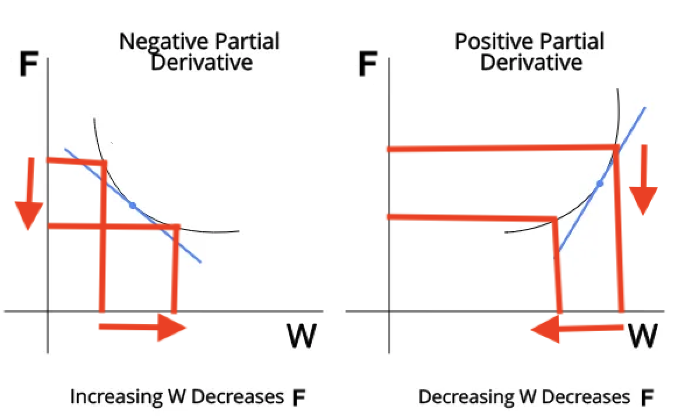

# Gradient Descent

Let’s take a simple example of an equation, $F(X_1, X_2) = W_1*X_1 + W_2*X_2$. If we find the partial derivative of $W_1$ or $W_2$ with respect to $F$, we can find out how $W_1$ or $W_2$ can affect $F$.

If the partial derivative of $W_1$ with respect to $F$ is POSITIVE, that means DECREASING $W_1$ will DECREASE $F$.

If the partial derivative of $W_1$ with respect to $F$ is NEGATIVE, that means INCREASING $W_1$ will DECREASE $F$.

 

So if we want to minimise the value of $F$ by changing $W_1$, we will update $W_1$ as follows based on the above inference :

> $W_1$ = $W_1$ - (partial_derivative * learning_rate)
>
> The learning is rate is a small positive integral parameter which will determine by how much we are decreasing $W_1$.
>
> If partial derivative is +ve the above equation decreases $W_1$ 
>
> If partial derivative is -ve the above equation increases $W_1$ 
>
> Ultimately decreasing the value of $F$ in all cases