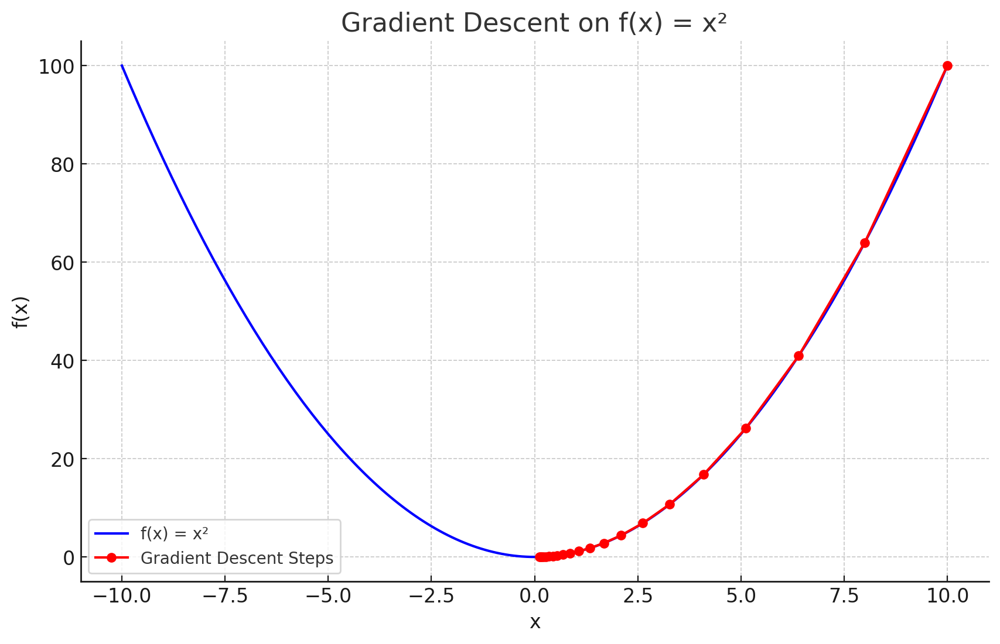

### 🔍 Problem Overview:

We want to **find the value of `x` that minimizes the function**
    → **f(x) = x²**
The minimum value of this function is at **x = 0**, because squaring any other number gives a higher value.

We’ll use **gradient descent**, a popular optimization algorithm, to get there.

---

### 📘 Concept of Gradient Descent:

Gradient Descent is like **going down a hill** to find the **lowest point** (the minimum).

* Imagine you're standing somewhere on the curve `f(x) = x²`, and you want to reach the bottom (x = 0).
* The **slope** at your current position tells you which direction to move.
* You take small steps in the **opposite direction of the slope** to go downhill.
* The **learning rate** decides how big your step is.

---

### 🧠 For f(x) = x²:

* Its derivative (or slope) is:
      → f'(x) = 2x
* So, to update `x` in each step, we use:
      → `x = x - learning_rate * 2x`

---
### 🧪 Example Walkthrough:

Let’s say:

* `init = 10`
* `learning_rate = 0.1`
* `iterations = 100`

Then in each step:

* Compute slope = 2 × x
* Update x = x - (0.1 × slope)

Eventually, `x` will become very close to **0**, which is the minimum of f(x).

Here's a visualization of how gradient descent works on the function **f(x) = x²**:

* The **blue curve** shows the function f(x) = x².
* The **red dots** trace the path of `x` as it moves closer to the minimum (x = 0) with each step.
* You can see the steps get smaller as we approach the bottom — a key behavior of gradient descent.

Let me know if you want to change the learning rate or initial value to see different behaviors!

---

### 🎯 Key Takeaways:

* **Gradient descent** repeatedly moves in the direction of steepest decrease.
* The **learning rate** must be chosen carefully — too small means slow, too big might skip over the minimum.
* Works best when the function is smooth and differentiable, like x².

