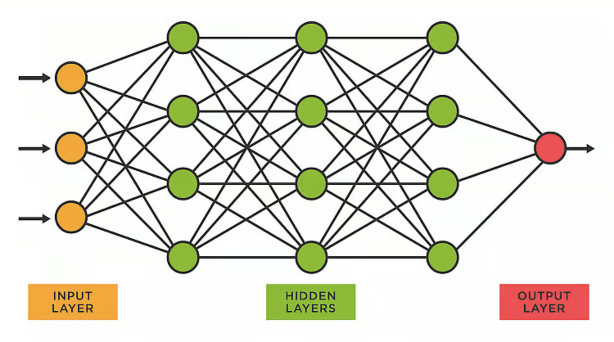
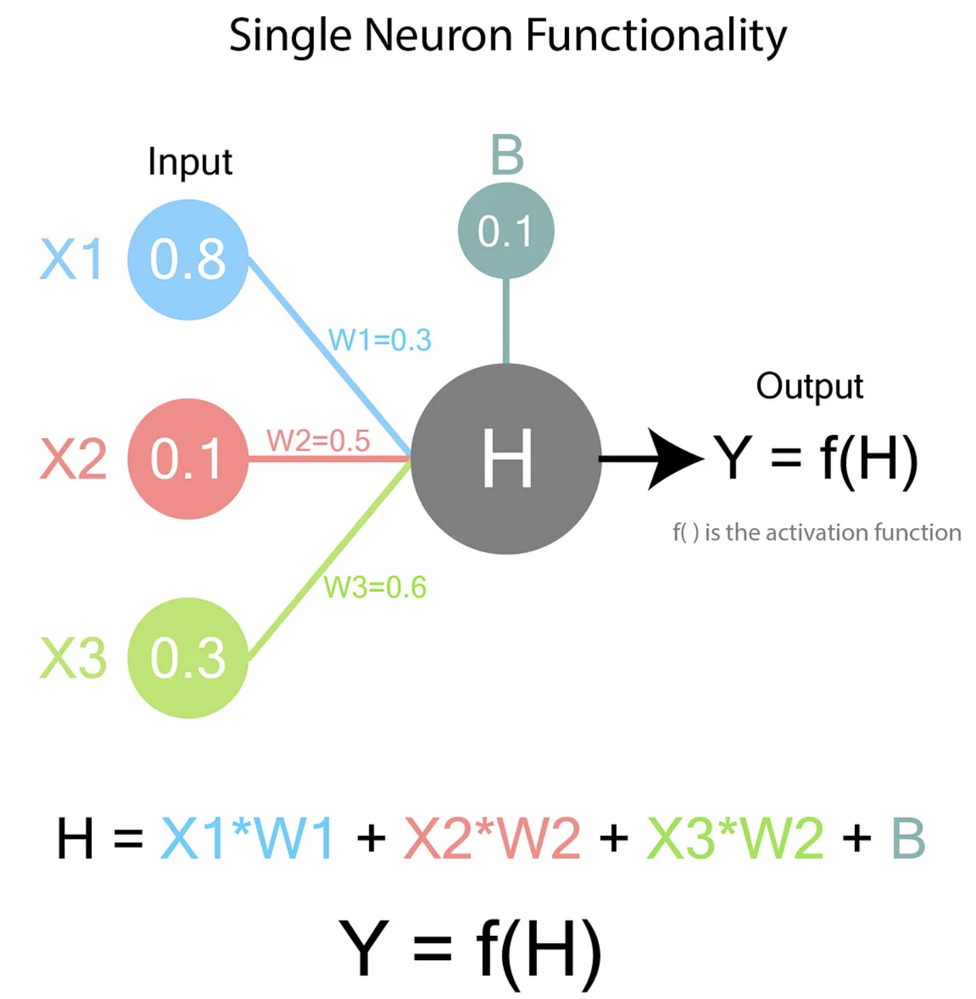
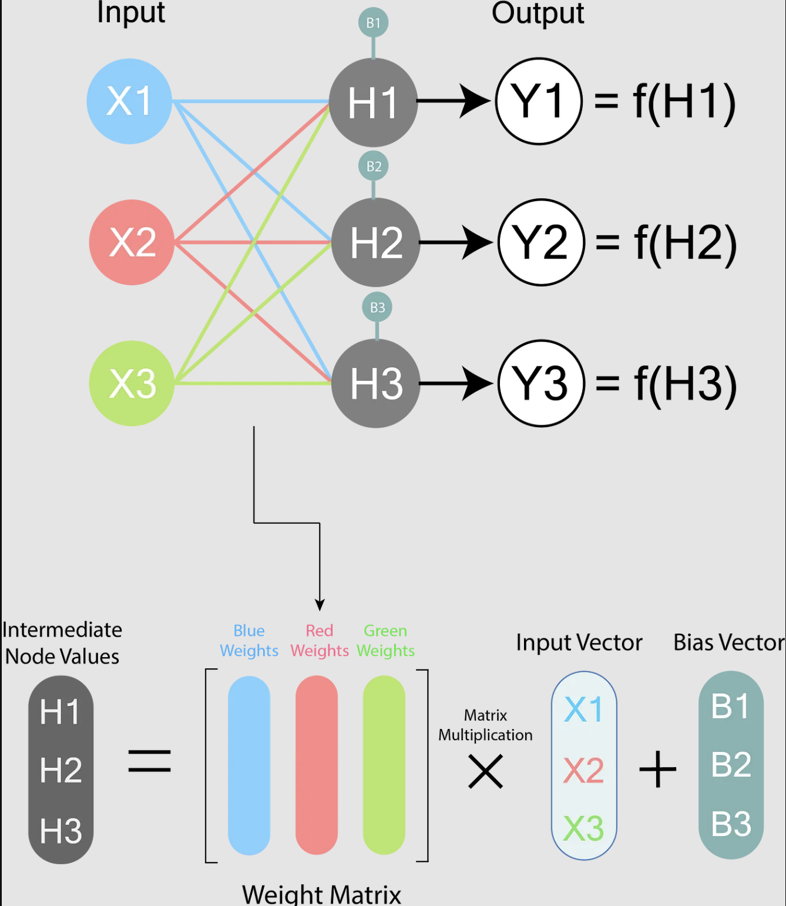
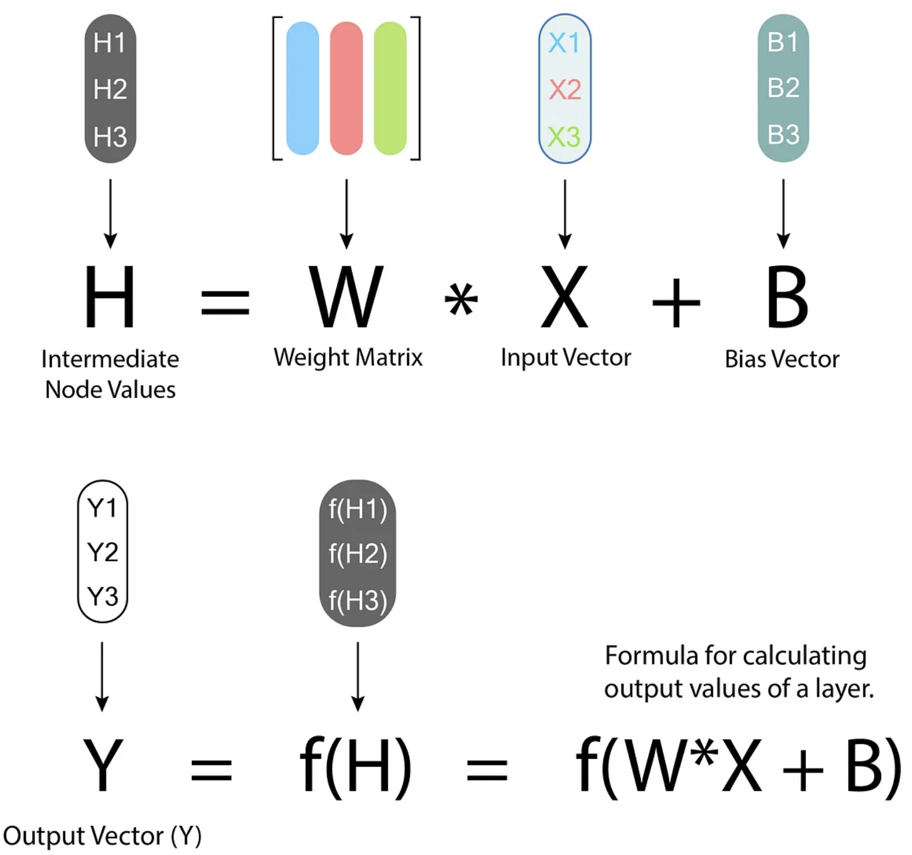
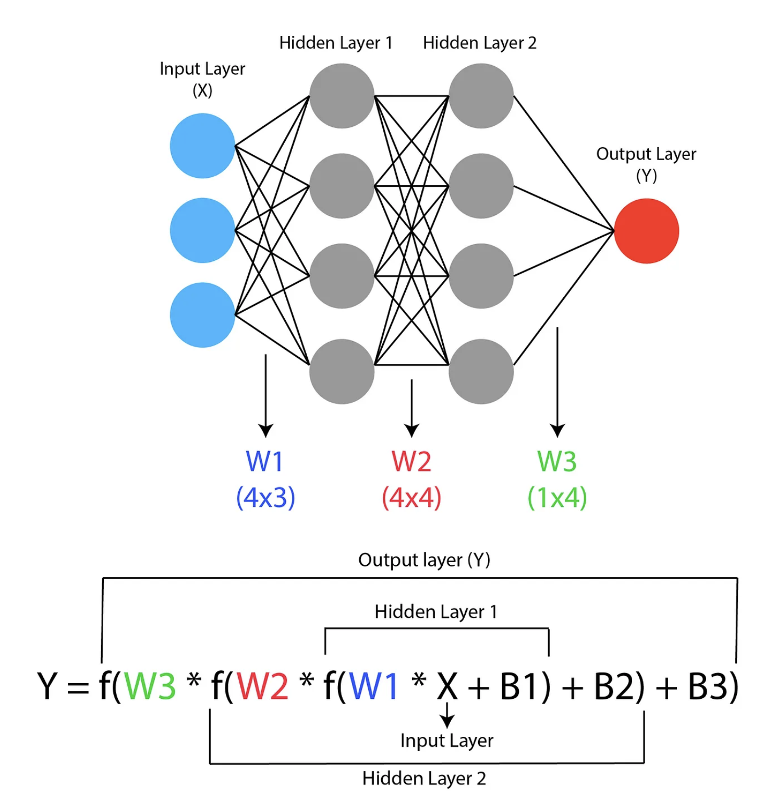
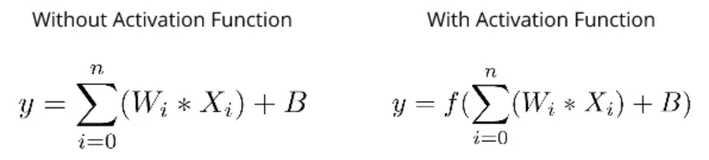

# Introduction to Neural Networks — Part 1

Neural Networks have become a huge hit in the recent Machine Learning craze due to their significantly better performance than traditional Machine Learning algorithms in many cases. The art and science of Deep Learning is built on the foundation of Neural Networks and how they work. Hence demystifying Neural Networks is going to be the first step in demystifying Deep Learning.

# What is a Neural Network?

It is essentially a naive implementation of how our brains might work. It’s not a very accurate representation but it tries to replicate some of the methods our brain uses to learn from it’s mistakes.

# Functionality of a Neural Network

Now let’s understand how a Neural Network is represented. A neural network consists of many Nodes (Neurons) in many layers. Each layer can have any number of nodes and a neural network can have any number of layers.

Now as you can see, there are many interconnections between the layers. **These interconnections exist between each node in every layer with each and every node in the previous layer. These are also called the weights between two layers.**

Now let’s see how exactly these weights function.

 

>Y is the final value of the node.
>
>W represents the weights between the nodes in the previous layer and the output node.
>
>X represents the values of the nodes of the previous layer.
>
>B represents bias, which is an additional value present for each neuron. Bias is essentially a weight without an input term. It’s useful for having an extra bit of adjustability which is not dependant on previous layer.
>
>H is the intermediate node value. This is not the final value of the node.
>
>f( ) is called an Activation Function and it is something we can choose. We will go through it’s importance later.

Now let’s look at the calculations between two complete layers:

 

> An M*N weight matrix means that it is between two layers with the first layer having N nodes and the second layer having M nodes. (i.e rows = number of nodes in second layer and columns = number of nodes in first layer)
>
> H, Y & B are is a M*1 matrices
> 
> W is a M*N matrix
> 
> X is a N*1 matrix

Now let’s look at a complete neural network.

# Role of Activation Function

Even though our neural network has a very complex configuration of weights, it will not be able to solve a problem without the activation function. The reason for this lies in the concept of Non Linearity.

We can observe that in this equation, there exists a linear relationship between the input and the output. However in the case of the equation with activation function, we can say that the relationship between input and output can be non linear, IF the activation function is itself non linear. Hence all we have to do is keep some non linear function as the activation function for each neuron and our neural network is now capable of fitting on non linear data.

# Summary

1. Neural Networks try to simulate how our brain works with multiple layers of nodes.
2. Each node in each layer implements linear regression.
3. So a neural networks boils down to multiple instances of linear regression which depends on previous layer.

# References
1. [Medium](https://medium.com/deep-learning-demystified/introduction-to-neural-networks-part-1-e13f132c6d7e)