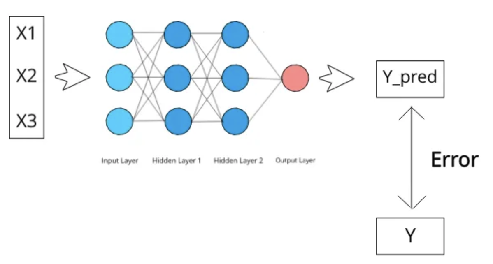
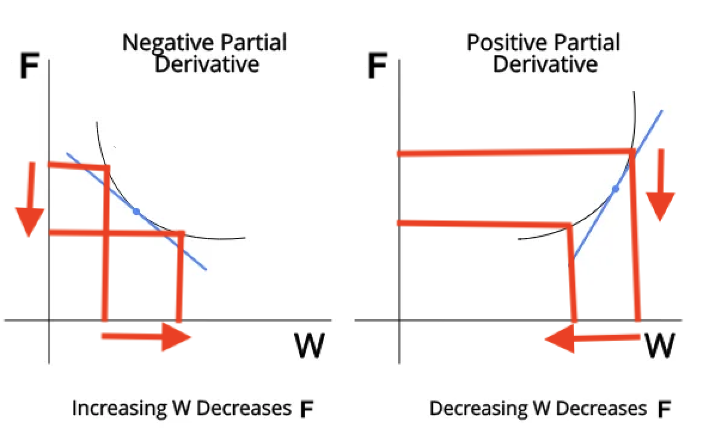
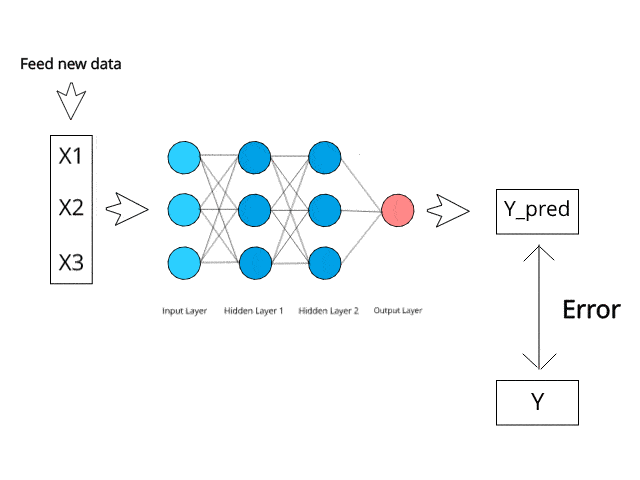
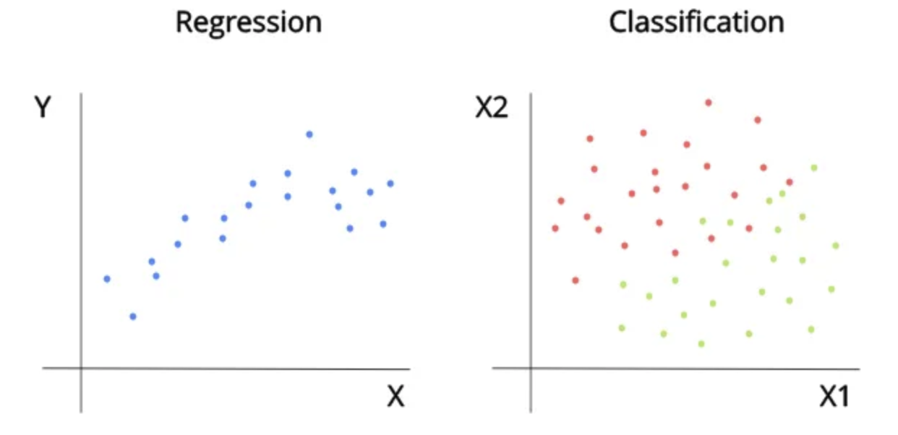

# Introduction to Neural Networks — Part 2

Now that we have seen how a neural network is represented, we can go on to see how exactly it works. Since there are many layers having many neurons, there exists a complex set of weights to get an output from some input variables. Each weight in this network can be changed and hence there are countless configurations a neural network can have. A **trained** neural network has some weights configuration which accurately predicts correct outputs from some input data and that is what we hope to achieve. We will now go through how exactly a neural network trains itself to get this desirable weight configuration.

## Backpropagation

Backpropagation is the name of the algorithm a neural network uses to train itself. This revolutionary algorithm is a mixture of the chain rule in derivation and gradient descent, which is a common optimization algorithm which is used in linear and logistic regression.

To understand how backpropagation works, first we have to understand the relationship between the output and the weights in between. It is clear that every weight in the neural network will affect the output in some way due to the way the neural network is connected. Due to this fact, we can say that if I change a particular weight, the output will change in some way. We can also find the exact mathematical equation defining the relationship between each weight and the output.

 

Since 
Y_pred is a function of all the weights in the model and Error is a function of Y_pred, 
 
we can say that the Error will also depend on the weights. 
 
This means that we need to adjust our weights in such a way that the error is minimized.

## Gradient Descent

Let’s take a simple example of an equation, $F(X_1, X_2) = W_1*X_1 + W_2*X_2$. If we find the partial derivative of $W_1$ or $W_2$ with respect to $F$, we can find out how $W_1$ or $W_2$ can affect $F$.

If the partial derivative of $W_1$ with respect to $F$ is POSITIVE, that means DECREASING $W_1$ will DECREASE $F$.

If the partial derivative of $W_1$ with respect to $F$ is NEGATIVE, that means INCREASING $W_1$ will DECREASE $F$.

 

So if we want to minimise the value of $F$ by changing $W_1$, we will update $W_1$ as follows based on the above inference :

> $W_1$ = $W_1$ - (partial_derivative * learning_rate)
>
> The learning is rate is a small positive integral parameter which will determine by how much we are decreasing $W_1$.
>
> If partial derivative is +ve the above equation decreases $W_1$ 
>
> If partial derivative is -ve the above equation increases $W_1$ 
>
> Ultimately decreasing the value of $F$ in all cases

This is the basic underlying concept of how weights are updated after we calculate the error. Since the last layer is the closest to the error, we will first derive the last layer with respect to the error and update those weights. Then we will move to the second last layer to do the same and so on and so forth. We repeat this process till we reach the first layer and all the weights are updated. This entire process is called backpropagation.

 

We perform backpropagation for a single row of data (1 data point) and update the weights. We then repeat for all the data available in the training data set, this entire cycle is called one **epoch**. Usually neural networks can take several epochs to train and it is up to us to decide how many epochs it will train for.

## Error Calculation Methods

Error is a very important part of a neural network because it allows us to estimate how poorly the model is performing and accordingly we can update our weights to improve performance. Now let’s go through how exactly error can be calculated in neural networks. The type of error calculation method we choose will depend upon the type of task we are trying to do. There are mainly two types of tasks a typical neural network can do:

1. Regression
2. Classification

Regression is when our output variable is continuous in nature. When Y is a numerical variable which we have to predict, the task is called regression. Examples include trying to predict house prices or trying to predict how many marks someone will score in an exam.

Classification is when our output variable is discrete in nature. When Y is trying to represent a certain class out of a defined number of classes, the task is called classification. Examples include trying to predict between a cat and a dog, or trying to predict whether an email is spam or not.

 

Here, we have to understand that in the regression graph the output variable is a continuous value just like X. In the classification graph, there are 2 input variables (X1 and X2) and the output is represented by the color of the points. Eg: Y = 0 for RED and Y = 1 for GREEN.
